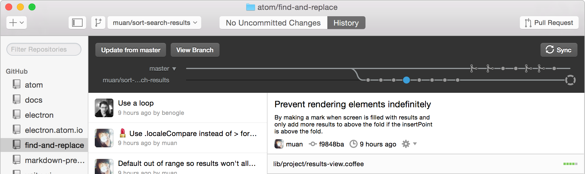

# Github Branching strategies

There are multiple ways that software development teams use github to collaborate. The primary way that most teams use is the default "Github Flow". This method caters very well for disjointed teams that do not adhere to client work. However it has its limitations when there is active projects being worked on for client work. For this reason I will be explaining alternatives throughout this document. This document is intended to describe different methods and draw attention to the pro's and con's of each method.

## A primer on Git

The first version of Git was released in 2005, it was created by the author of the Linux Kernel Linus Torvald. Git's name is arbitrary and does not stand for anything particular, however "git" is British slang for a stupid or unpleasant person. Linus proclaims he names all of his projects after himself, hence Git can be looked at as unpleasant or even a stupid issue tracker. Git is a very versatile tool that can be applied in thousands of different ways. It can be used as a tool to track changes, as well as a tool to transfer files. All git clients support a few primary concepts.

- Branching
- Merging
- Committing
- Reseting
- Initializing

Git utilizes the `.git` folder in the root of every project to track changes as well as the configuration of the git client. This can include utilizing hooks to invoke an certain action as well as using templates so that every commit includes the proper information. The `.git` folder also stores the remote and local repository information. Having git keep track of this information can allow the user to understand better what version of code they may be working on or even if their local copy of code is ahead or behind the remote version.

### What is Git missing?

Git's inherent versatility allows users to manipulate projects anyway they see fit, however sometimes these manipulations may not be intentional or they may not be in the same fashion or strategy their teammates may have manipulated their local instance of the same project. This is the reason several workflow strategies exist within the git community and it is also why their is such debate on the most efficient method.  

_[Git Flow](http://jeffkreeftmeijer.com/2010/why-arent-you-using-git-flow/)_ - is a strategy for teams to interact with code on a 'Release' basis. What this means is that its primary objective is to protect the 'Master' branch at all costs. The technique of doing this is by having 99% of the development work to be conducted on the 'Development' branch and only merge the branch to 'Master' when a release has been slated to go public.

_[Git Hub Flow](https://guides.github.com/introduction/flow/)_ - is a strategy pioneered by the GitHub community. It is designed not to protect a particular branch but instead to release as often as possible. The check and balance mechanism here is the use of "Pull Requests". This works particularly well on projects that can afford to be re-deployed several times a day or even sometimes several times an hour. There are certain philosophies about how to prevent regression through the use of structured testing and specs, but for the most part the strategy is based around the idea of releasing as often as possible while having a human review factor.   

_[Hub Flow](https://datasift.github.io/gitflow/GitFlowForGitHub.html)_ - Hub Flow is fork from the 'Git Flow' project that attempts to take the best of both strategies by combining them to work together. The major change in philosophy is instead of trusting that commits to the Develop branch are sufficiently tested in a Git Flow process it adds an extra layer of security by requiring Github's pull request process to be used to authorize the addition of new features to the develop branch where it can be further tested before release to master.

### What is the correct strategy?

Depend on the project or team, here are a few working examples why three different teams might prefer one method over the other.

_Team Microsoft logistics_ - An old school bunch that has been doing software development since before Git was invented. They primarily work on anywhere between 5-10 .net projects for different shipping container companies. Inventory systems, document management, and customer relationship software is where their skill sets really shine. They migrated from SVN to Git in hopes of speeding up their development time but with a priority of never shipping bad code. For this reason they choose Git Flow as their method of organizing hoe work gets committed. Every developer on the team works in branches named according to the feature they working on and never particular have their own branch of the code. When one developer is done working on the feature they merge it into development. Once the code is rolled into development they have their sysadmin deploy it to a staging server and the QA team takes over, if QA fails they inform the developers and the process starts over until the code is perfect. Once the code reaches a shippable point the team collaborates determines what version of the code they plan on releasing. They open a a release branch of the software and update the release notes for the instructional manual. Once they complete the documentation they then merge the release branch into master and back merge the code into development. This process works well for them because they are able to know that their code never ships to master until it has been reviewed verbosely on the development branch and that all major issues are fixed prior to shipping.

_Team  Google moonshot_ This  is a a bunch of young haphazard developers that have their heart in the right place and are often very successful, however their code typically contains tons of known errors and best practices may not always be followed. They concentrate their efforts on one agenda typically for themselves and truly believe what they are producing will change the world. They  are dependent on the  safe guards to be in place so that they don't release anything into the wild that might cause harm, but at the same time they want to make changes the moment it comes to mind. This team follows 'GitHub Flow' approach to collaborating. When a new feature is needed or an improvement needs to be made on the code base they create a private branch from master typically named after the developer and not the features they intend on working to build. They make their changes and then open a "pull requests" via github.com. Once the pull request is open they come together as a democracy and discuss the value of merging the code into the master branch, some members of the committee might take it upon themselves to deploy the code to their local or staging servers to test it but for the most part the "QA" work falls on the committee that has write access to the repository. It could be that the code adds new functionality or that it fixes a production problem, either way once the request is 'Merged' it will advance the master code branch.  

_Team Hired Guns_ This team is a even mix of seasoned professionals and entoepanuours. Their primary goal above all for them is to work and get paid, they do not necessarily fall to the ideologies of releasing code in monolithic chunks overtime, but they also do not care to release risky code at such a high pace that releases are not distinguishable. They typically find themselves working on a few hundred projects a year that have definitive deadlines and feature sets. For this reason this team chooses 'Hub Flow' as their primary release method. With Hub Flow they are able to take advantage of the committee based review cycle for changes with github.com but they are also able to to lock the code to specific release versions that allow them to bill their clients on exactly what is to be delivered. They conduct the majority of their  testing on the development branch and use feature branches to work on client requests. When they need to merge a feature branch into the development branch they open a "Pull Request". Once the committee reviews the Pull Request they merge the code to development. After the code is living in development it is then pushed to a staging server to be reviewed further by QA, while the rest of the development team continues to work on other requests. Once the product owner of the team determines that all the features that are now live on development have hit a critical mass and a new version should be released they begin work on a release branch. While working on this branch the finale touches are added such as release notes, client instructions, change logs, and possibly some other last minute touchups. Once complete the release gets tagged and merged to Master and back to development. In Github this appears under the release version tags and a full download of the final code at that particular point in time can be distributed to the client.

#### How do you decide which is right for you?

The way the Microsoft team works, it is apparent that they spend most of their time working on the same projects. Git Flow is a good solution for them as it offers a very repeatable and a very predictable workflow. They are not worried about necessarily creating the next big thing but primarily concerned about maintaining a large code base and to maintain clear cut roll back points if the need arises. The Google team on the other hand have a different primary objective, they want to produce code that is new inventive, competitive, and never been seen before. They try to remove as many obstacles in the process of delivery but recognize that not all plans or developers are perfect. They use a democratic strategy to best determine when code is released but it is the voting parties responsibility to effectively test the code before it is merged. The Hired Guns on the other side need to remain fast and inventive but they also have a responsibility to their clients in releasing quantifiable work. This is the reason they choose to blend both Git Flow and Github Flow (Hub Flow). They want to protect their master branch so to never regress but they also want to produce quickly and allow the QA teams to always be busy finding bugs.

#### Is this just a way to use Git or is there something more?

All three of these methods do not actually require any new software. The default Git client installed on every mac is all you need to get started. However because each method has a repeatable process it tends to be easiest to use tools to take some of the guess work out of each process.

## Branching tools

The next few sections are going to walk through each process and the use of the tools, it will not encompass every `git` command nor will it cover `git` basics like `fetch`, `merge`, `rebase`, or `commit` it will however cover unique commands to each tool. The tools covered are "Git Flow", "Github.com", and "Hub Flow".

## [Git Flow](https://github.com/nvie/gitflow)

Git Flow is a set of plugins for `git` it allows the end user to take the thinking out of following Git Flow method and use the tool to make the right decision when making a branching choice.

- `git flow init` will initialize a repo for use with git as well as create the local `develop` and `master` branches.
- `git flow feature start NEW_FEATURE` will create a new branch titled `feature/NEW_FEATURE`
- Once new commits are made the developer can push this feature branch to the remote repository to be worked on later or by another developer.
- `git flow feature finish NEW_FEATURE` will merge any changes committed to `feature/NEW_FEATURE` into the `develop` branch then delete the `feature/NEW_FEATURE` branch.
- At this point someone will need to delete the feature branch from the remote repository.
- `git flow release start 1.0.0` will start a new branch titled `release/1.0.0`
- Once new commits are made the branch can be pushed to the remote repository to be worked on later or by another developer.
- `git flow release finish 1.0.0` will merge  any changes committed to `release/1.0.0` into `master` then it will back merge the changes to `develop` once merging is complete it will add the version tag `1.0.0` to `master` and delete the `release/1.0.0` branch.
- Once the merges are complete the developer can push each local branch to the remote repository and delete the remote release branch.
- `git flow hotfix start bug-fix` will create a new branch titled `hotfix/bug-fix`
- Once new commits are made the branch can be pushed to the remote repository to be worked on later or by another developer.
- `git flow hotfix finish bug-fix` will merge any changes committed to `hotfix/bug-fix` to `master` then back merge to `develop` then it will delete the `hotfix/bug-fix` branch.
- Once the merges are complete the developer can push each local branch to the remote repository and delete the remote hotfix branch.

_An illustration of the Git Flow Model_

## [Github Flow](https://guides.github.com/introduction/flow/)

Github Flow does not have any true command line tools or client based tools, instead Github Flow is a feature set of github.com. Github Flow uses the online set of tools to keep everyone collaborating and requires the user to keep track of the branching model on the site.

- `git checkout -b new_branch` will create a new branch called `new_branch` on your local machine.
- `git commit -m "first commit"` will commit changes to your local branch.
- `git push origin new_branch` will push the new branch from your local repo to github.
- Once your changes have been pushed to the new branch on github you will see the new branch available in the branch menu.
- Select your new branch and click 'Create Pull Request'
- The next screen will ask you which branch you would like to merge the request into once the request is approved in this workflow the branch will always be `master`.
- Once the pull request is open and does not have any merge conflicts anyone who has read access to the project will be able to comment on the new feature and review the changes you are proposing.
- Once someone on the team who has write access to the project decides the changes are suitable they will have the ability to click "Merge Pull Request" pending all merge conflicts have been fixed.
- Once the branch has been merged an option to delete the old branch will appear and it can safely be removed.
- If you are working on a particular release then the same procedure exists but instead you would click the Draft a new release option under 'Releases' but only write access users can review the release prior to being committed.
- If you are working on a hot fix then the same pull request procedure is used.
- At this point you will have to clean the old branch off of your local repo and click delete branch on github.com

_An illustration of the Github Flow model_ 

## [Hub Flow](https://datasift.github.io/gitflow/)

Hub Flow attempts to combine both Github Flow with Git Flow. '[Data sift](http://datasift.com)' provides a set of plugins that allows you to use a very similar set of commands as you would for 'Git Flow' however has some built in features that allows for a more seamless integration with github.com. Since the tool is dependent on the remote repository it first must be created on the github.com itself.

- create a new project on github.com called new_project. Do not select the initialize repo option, as we will do this using Hub Flow.
- `git clone https:/github.com/newrepo/new_project.git` then `cd new_project/` to clone the repository to your local machine and switch into the repository.
- `git hf init` will create a new `master` and `develop` branch while simultaneously creating a new `origin/master` and `origin/develop` branch on github.com then it will checkout the `develop` branch locally.
- `git hf feature start new_feature` will create a new local branch called `feature/new_feature` as well as a remote branch `origin/feature/new_feature` and check out `feature/new_feature` locally.
- `git hf push` will push all local changes to the remote branch you have checked out.
- At this point you can go to github.com and see an opportunity to open a pull request.
- Once the pull request has been peer reviewed it can be merged to develop.  
- `git hf feature finish` will delete both the local `feature/new_feature` branch as well as the remote `origin/feature/new_feature` branches. **NOTE:** Hub Flow will not allow you to 'finish' the feature until the pull request has been merged on github.com.
- `git hf hotfix start new_bug` will create a new branch called `hotfix/new_bug` locally as well as a new remote branch called `origin/hotfix/new_bug`
- `git hf push` can be used again to push the changes.  
- `git hf hotfix finish new_bug` will merge the new changes to `master` and then back merge to the `develop` branch both locally and remotely and does not stop you if there has never been a pull request.
- `git hf release start 1.0.0` will create a new branch called `release/1.0.0` locally and a branch called `origin/release/1.0.0` remotely.
- `git hf push`can be used to push release notes or other changes to the remote branch.
- `git hf release finish 1.0.0` will merge the branch `release/1.0.0` locally and remotely to `master` and `develop` respectivly. It will then add the tag `1.0.0` and delete the branch `release/1.0.0` locally and `origin/release/1.0.0` remotely.

_An illustration of the Hub Flow model_ 

### Friendly tools

Several Git clients exist for a multitude of platforms, however not all of the clients include Git Flow tools or Hub Flow tools. Here are a few highlights of tools that might play well depending on the way you prefer to work.

#### Text editor plugins

_[Atom](https://atom.io)_ is a text editor developed by the same people who built Github.com ironically it does not have any baked in solutions for git however through the use of packages the community has greatly extended it's capability.

- [Git Plus](https://atom.io/packages/git-plus)  is a package for interacting with common git commands while within Atom.
- 
- [Git Clone](https://atom.io/packages/git-clone) is a package for clone repositories while within Atom.

  

- [git control](https://atom.io/packages/git-control) is a package that gives a gui interface for common git commands as well as Git Flow commands.

  

- [git controlhub](https://github.com/alexisaperez/git-controlhub) Is a fork of git-control but swaps out Git Flow functionality for Hub Flow.

_[Sublime](https://www.sublimetext.com)_ is a text editor that predates Atom. It can be greatly extended using a add on called [Package Control](https://packagecontrol.io/installation) that allows you to install additional packages to extend the functionality of sublime.

- [Git](https://packagecontrol.io/packages/Git) is a basic plugin to use git functions within sublime.
- [Github Tools](https://packagecontrol.io/packages/Github%20Tools) is a plugin to bring all of the features in github tools within sublime.

#### Stand Alone clients

- [Github Desktop](https://desktop.github.com) Stand alone client that tries to keep feature parity with github.com.

  

- [Tower](https://www.git-tower.com) Stand alone client that supports Git Flow

  

## Conclusion

At the end of the day it is up to the entire team to agree upon what method works best for them. It is imperative that each team member understands the differences and shortcomings of each method. It has been proven that each method works and produces great results. However it is important to consider that any successful team that plans on collaborating on source code must choose one method and stick with it so that results remain consistent and friction free.

- **Git Flow**  - For projects that need to keep the master branch deploying to production systems while maintaining uptime and have clearly defined releases of the code.
- **Github Flow** - For projects that can deploy code to the master branch as frequently as possible and trust the human code review process to protect against errors in each release.
- **Hub Flow** - For projects that need to keep master branch as bug free as possible while also offering to have peer code review before code makes it to the final release.

** A note on Automation: Many infrastructures have built in a high degree of automation for QA and Production release deployments. In the most rudimentary way Git alone can be used to automate deployments, though likely not super efficient for large infrastructures. Depending on what part of the tool chain the automation occurs at it can decide which type of branch management a project uses. For instance if the project uses automatic tests that can be executed by a continuous integration tool then the team may choose to implement the Github Flow strategy. This is because the CI tool would be triggered anytime there is a change on the Master branch. If the CI tool passes all of it's tests it may be configured to deploy the code directly to production, or multiple environments at the same time, if failed then it will simply trigger a failed deploy. However if a team is not writing automatic tests then they may choose to use Hub Flow or possibly Git Flow so that the CI tools only deploy code on the develop branch to a QA environments while only deploying the master branch to the production environment.   
