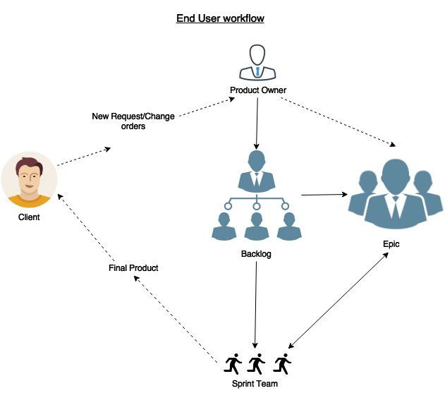
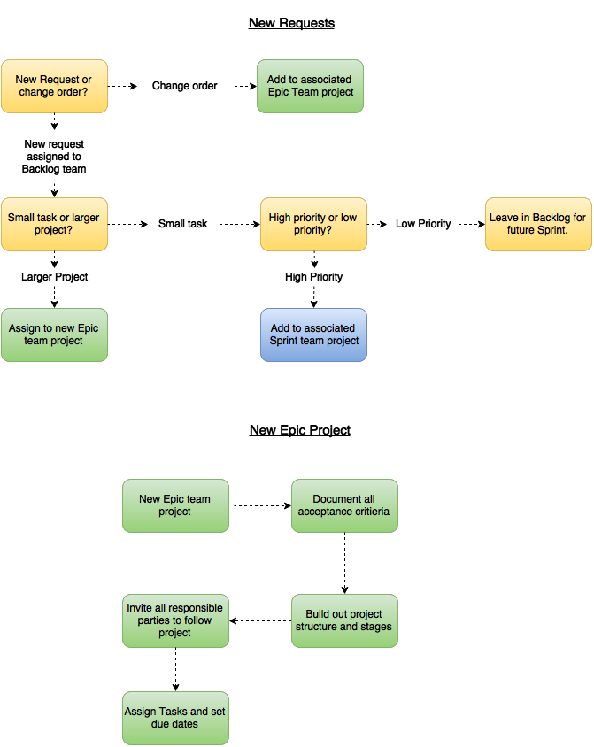
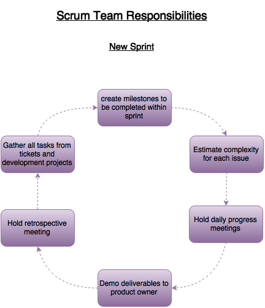

# Asana - Sprint workflow
Asana allows for multiple teams to manage their organization of projects and tasks. At Tamman these teams are organized by the type of work each team is responsible for. Team members can belong to multiple teams but the nature of the work or how the work is organized can be different per team. A break down of each team and the associated work in each team is below. I will be using a restaurant analogy to help fill in the gaps.

#### Team - Office (Administration, hostess, dishwasher)
Projects under Office are stored for items that are central to the administration of the company and do not serve as a technical ground for maintaining cadence across the other teams. This is akin to the hostess position in a restaurant, they are in charge of seating the customer, setting expectations, and creating a smooth atmosphere.

#### Team -  Tickets/Issues (Backlog Curation, Front of House)
All client opened issues, questions, tasks, requests exist in the tickets/issues team. These tasks are to remain in this teams associated projects until they are completed across all projects. The primary purpose of storing clients requests in this team is to maintain accurate organization of billable tasks per client. Top level tasks, change orders, or client job numbers are the types of tasks that should be recorded under this team. Maintaining an account of billable work within this team is vital to maintaining the client relationship. Tasks in projects for this team can be added to projects in Development and Runners teams, but tasks created in Development or Runners can not be added to projects in this team. This can be thought of as the waitress or waiter of a restaurant, it is their job to collect the order, ensure the order is correct and to charge the customer once the customer has been served. It is also possible that they might prep small plates or put the finishing touches on a dessert. At the end of the meal they deliver the check to the customer for payment.

#### Team - Development (Epics, Chef)
This is the primary team where long running projects are worked on, the goal of this team is to organize all of the smaller tasks that are supporting larger requests that are reported in the Tickets/Issues Team. It is this teams responsibility to define all of the tasks and milestones that are required to complete a particular clients requests. This is not a team that handles short run projects but rather a team that is focused on larger milestones that might evolve as scopes are determined or changed. Tasks in Development projects can exist both in Tickets/Issues as well as Runners but tasks created in Runners can not exist in Development. This is the equivalent to the Chef or Back of House positions at a restaurant, it is their job to transition the orders of customers into final products by breaking down the dishes into smaller consumable pieces, and testing to make sure the food is suitable for the customers.

#### Team - Runners (Sprints, food runner)
Projects in the Runners team are loaded with tasks from other teams and built to fit a pre-determined length of time. For example a project titled "Weeks 23-24 - GFX,MMM, and Comcast" would be filled with all the tasks that the team has determined needs to be done within weeks 23 and 24 of the year. The tasks within these projects can vary from different clients and can have multiple deliverables. Tasks found in projects assigned to this team can coexist in Development projects as well as Tickets/Issues. This would be the equivalent of a food runners or the line cook staff that plates the food before it is delivered. Their primary goal is assemble all of the dishes that need to be delivered ensure that everything that is promised will be delivered on time and to deliver the end product to the table.

## Project relationships
The process of each of these teams work in concert with each other to deliver final products to the customer. Just like in a restaurant when a customer gets seated, orders food, has the food prepared, and finally gets to enjoy the meal, this process is designed to keep the restaurant delivering in a consistent manner. When it comes to software engineering the work although technically different gets handled in much the same way.

 

_Triage_
* Assigned to "Tickets/Issues"
* All projects regardless of size have a corresponding task in one of the projects assigned to this team.
* As client requests are quickly assessed and appropriately dealt with if this team can not handle the request it is escalated to the development team  to work on.

_Scope and Development_
* Assigned to "Development"
* Only larger projects are escalated from "Tickets/Issues" exist within this team.
* Tasks are much more granular and can express true user stories needing to be fulfilled to meet the criteria of the project.
* Projects that are assigned to this team have multiple stages and may have tasks move through move these stages such as scope, research, development, and QA before the project is complete.
* The last task on every project will be to ensure the project meets the acceptance criteria defined in the original request which lives under "Tickets/Issues"
* The analog to a restaurant would be the individual recipes that make up a cuisine.

_Sprint_
* Assigned to "Runners"
* Sprints have a defined length of time and a clear set of tasks to be completed by the conclusion of the sprint.
* Project names reflect the over all goal or length of a sprint but do not need to be client or deliverable specific.
* Tasks found within the spp align="center>n come from the "Development" team and the "Ticket/Issues"
* The primary goal of a sprint projepto define exactly what is intended to be done within the given time period.
* Keeping with the restaurant analogy a sprint would be the cadence and tasks required to deliver the food to the table as well as the over all goal of how many plates of food to serve in any given day or week.

## Agile goals
Their are three primary goals of the Agile project management methodology at Tamman.
- Maintain flexibility and enable the team to pivot quickly when encountering road blocks. This is akin to the "fail often, fail quickly, but get back up" ideology.
- Improve the teams efficiency and cutdown on ambiguous direction. Using up to date tracking tools and improving inter-team communication encourages cadence.
- Reduce the amount of time and frequency needed for meetings. To support this there are only four primary meetings within a sprint cycle; kickoff, daily standup, demo, retrospective.

#### Roles
_Scrum Master_
> The role of any scrum master is to conduct each meeting, with the goal of clearing any external blockers. It is also the goal of the scrum master to focus the efforts of each meeting towards clear objectives.

_Product Owner_
> A product owners primary goal is to ensure that the backlog of work for the sprint team to be working on is always filled. This includes meeting with each external requester and communicating clear objectives and requests. It is also the duty of the product owner to understand and anticipate the end users needs and desires so that they can be communicated during each kick off and demo.

_Scrum Team_
> Scrum team members are responsible for deriving the amount of work and how the work in any given iteration will be completed. It is this teams responsibility to produce the deliverables of each sprint. By using previous sprints as a guideline for predicting the teams ability to complete the work provided by the Product Owner, allows for better estimation of tasks and user stories.

#### Agility

By maintaining short iteration cycles (no longer then 2 weeks) Agile allows the team to adjust to external influences rapidly as well pivot when a direction may no longer be the best course of action.
- **Kickoff** - Begining of each sprint, allows the team to evaluate all the factors now present since the last sprint.
- **Daily Standup** - Allows the team to bring blocking issues to the surface to the whole team as well as to report on the current progress. This allows the team to adjust on a daily basis.
- **Demo meeting** - This meeting is scheduled near the end of a sprint. The primary purpose of this meeting is to determine if all of the completed tasks and stories meet the original purpose set at the kickoff.   
- **Retrospective** - This meeting alows the team to come together once the "work" is all complete and dive into the issues that were encountered and what the team could do betp align="center"> the next sprint to avoid issues from happening again. This is a time to discover how the team can "re-tool" before starting the next p

#### Team Cadence

Understanding team cadence can be an art in itself. Traditionally this is measured by applying a point system to each task and depending on the total points achieved by the team indicates the teams technical capabilities. Once measured  over several sprint cycles it can be gleaned that the team is capable of a certain "velocity" which can be used for estimating completion of larger projects that may span multiple sprints. The topic of points and measuring Cadence is out of scope for this docump align="center"t will be addressed in future documentatp

#### Meetings
Within the sprint cycle there are only four primary meetings. These meetings include; Sprint kickoff, Daily standup, Sprint Demo, and Retrospective.

 _Sprint kickoff_
>The kick off meeting is vital to the way the team plans the work they are tasked with. In some circles this meeting is called "planning poker" or simply the "Scrum". The Idea comes from Rugby, where the players gather in a locking formation to gain control of the ball. When it applies to Agile this meeting is for all of the people responsible for a sprint to put their heads together to plan and strategize on how to complete the work that must be done within a given deadline. This is an opportunity for everyone on the team to collaborate and size different tasks appropriately but more importantly this is an opportunity to understand the priorities of the team.

_Daily Standup_
> The daily standup is designed to keep a pulse on the progress of a sprint, by having all of the people responsible for the work reporting daily it allows the whole team to understand if they are on track or not. It also allows the "Scrum Master" to be aware of any potential blocking issues that may need to escalated in order to unblock.

_Sprint Demo_
> This meeting occurs at the end of a sprint cycle, it allows the team to asses if they have met the overall goal of the sprint. The meeting is designed to show the teams progress to the product owners so that they can interface with the clients. Sprint demos are for internal teams and are not for showing directly to a client. This meeting also serves an opportunity to add missed items to the backlog.

_Retrospective_
> The retrospective meeting is the only non project oriented meeting. It is designed to review the team as a wholes performance and to see what can be improved  before the next sprint starts.  
